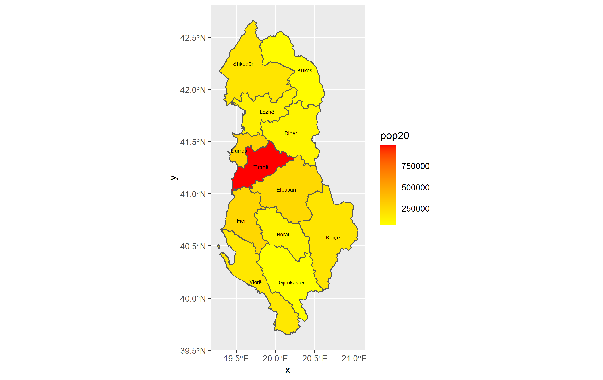
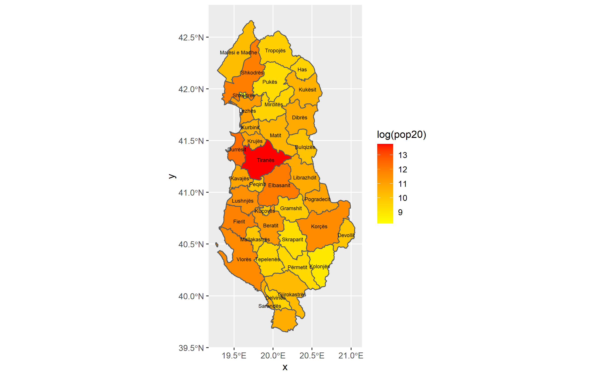

# Project 1

## Challenge Question

This image is a heat map of the population in Albania with the first administrative subdivisions.

## Stretch Goal 1

This image is a heat map of the population on a logarithmic scale in Albania with the second administrative subdivisions.

