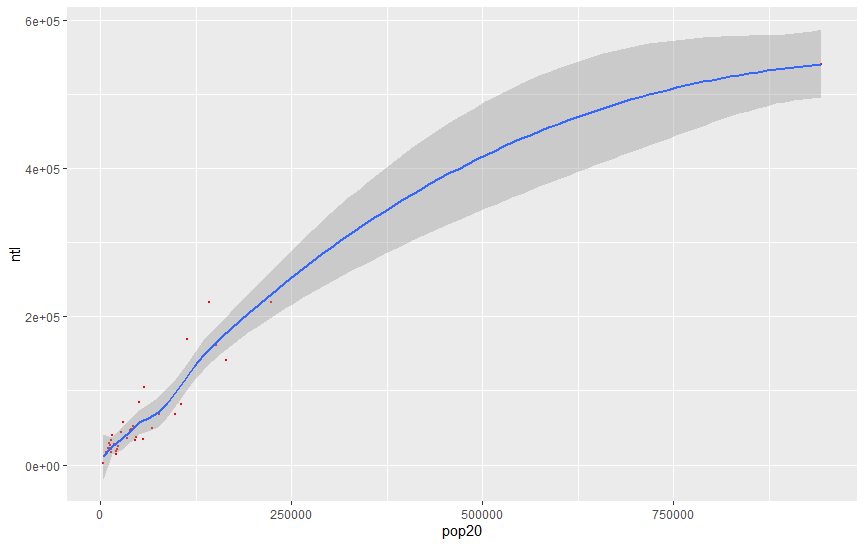
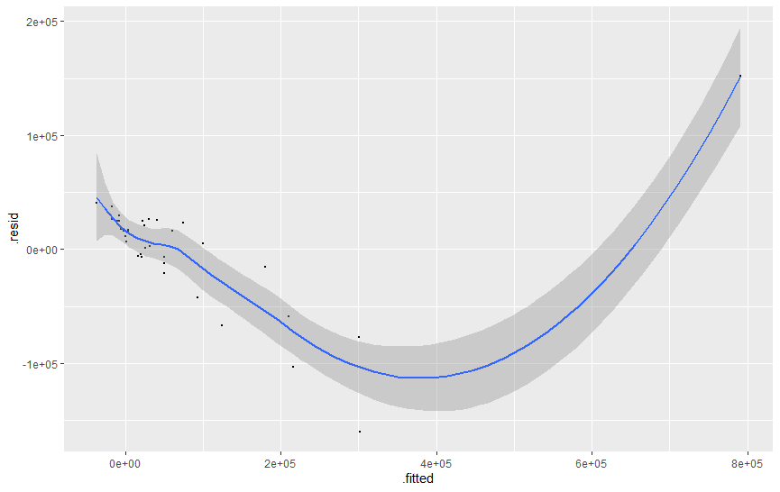
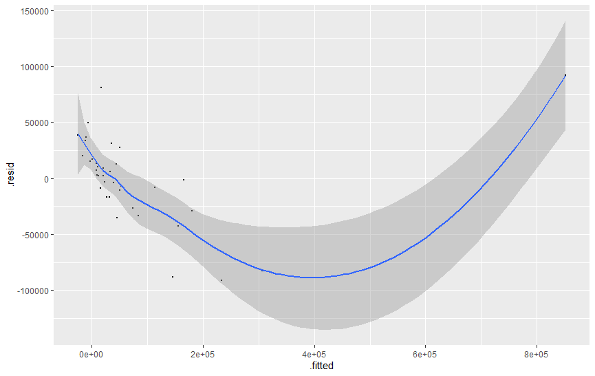

# Project 2

## Challenge Question \#1

Combined histogram of logarithmic population with density.

Combined histogram of logarithmic night time lights with density.

## Challenge Question \#2

Linear model of the correlation in night time lights predicting population in Albania's administrative subdistricts.

Linear model of the correlation in night time lights, urban cover, and bare cover predicting population.

Linear model of the correlation in all the variables predicting population.

