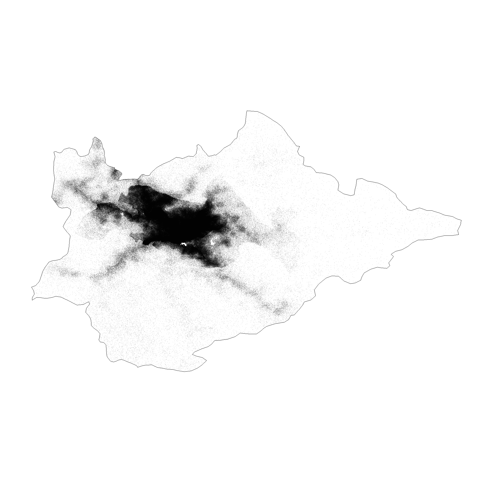
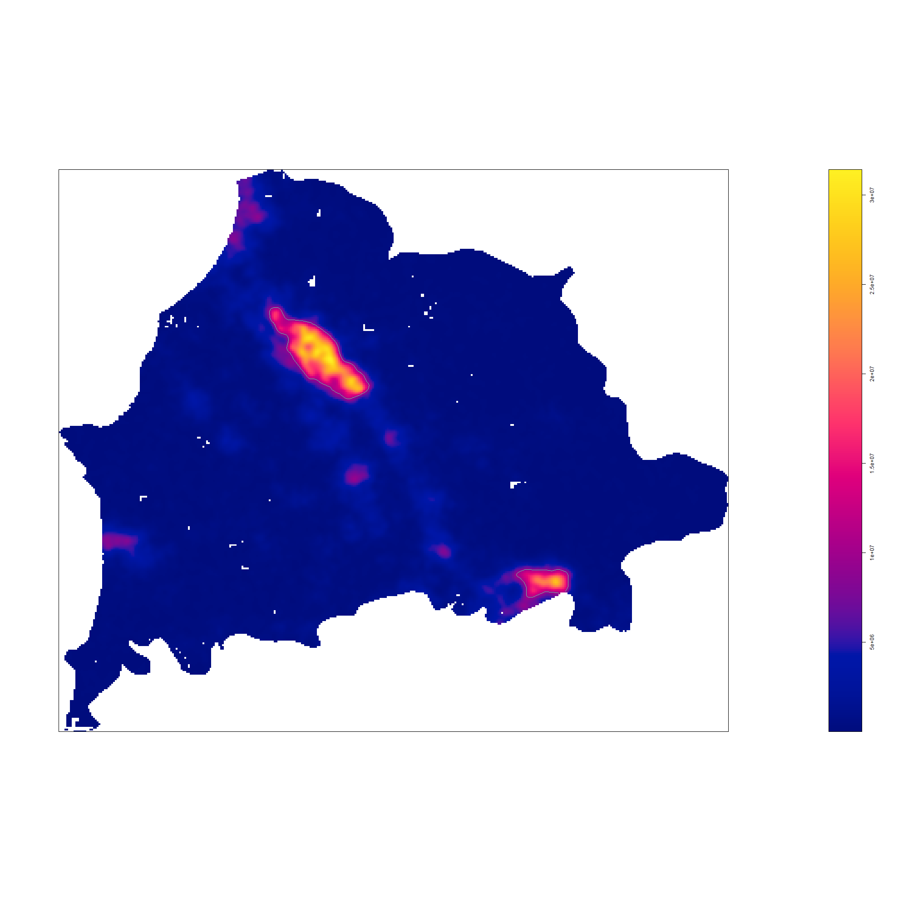
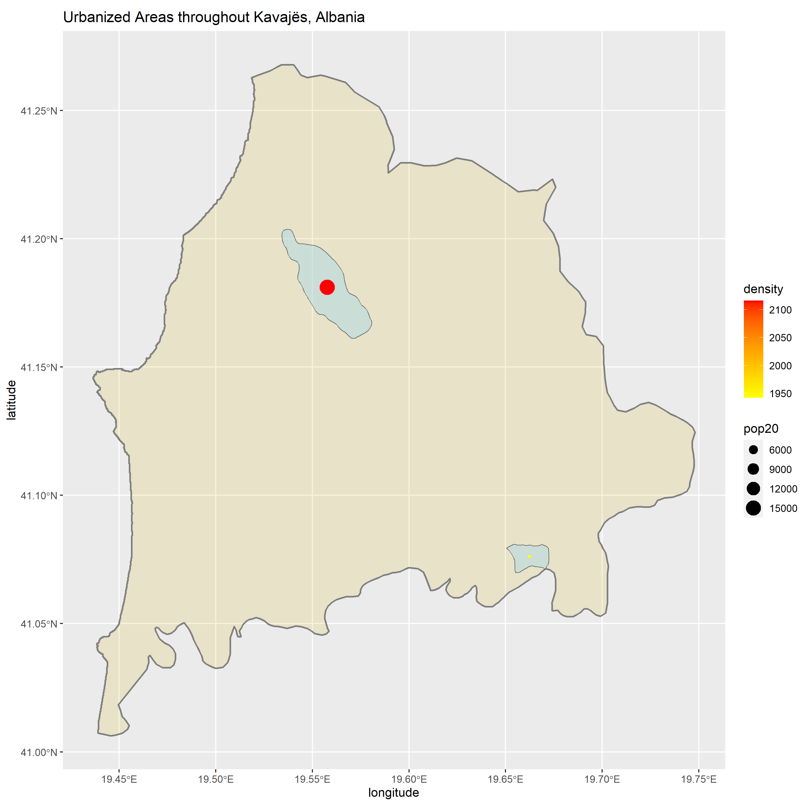
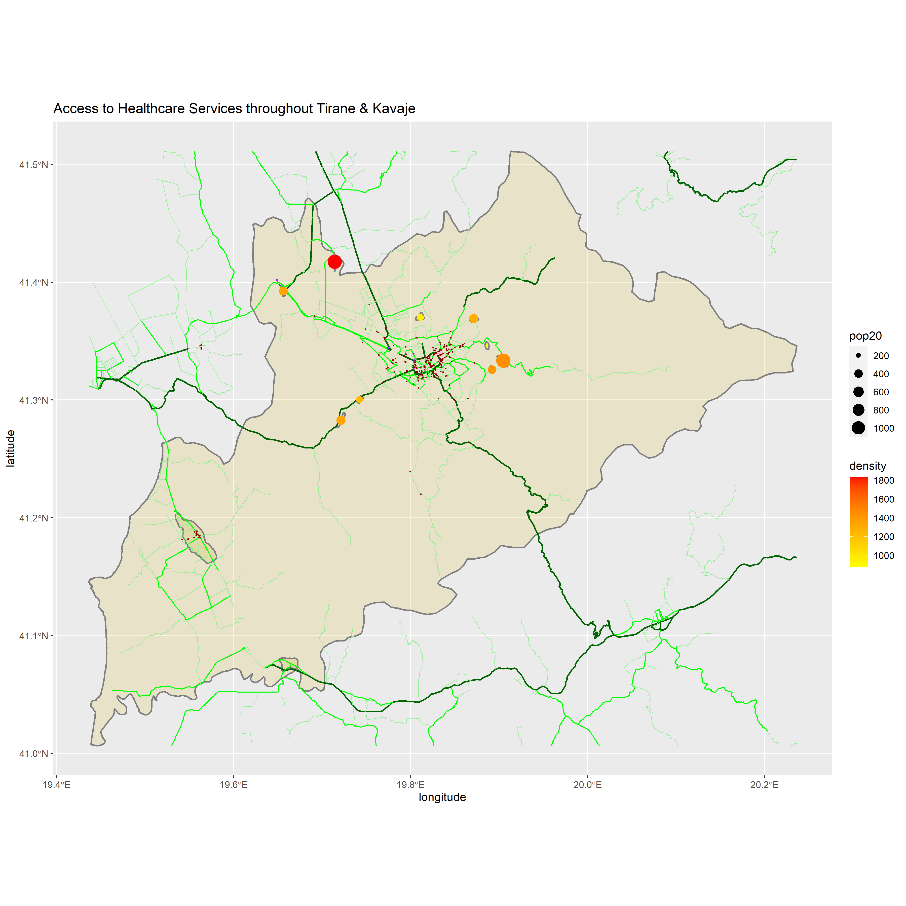

# Project 5 and Final

## Accessibility 1

### First ADM2: Tirane

### Second ADM2: Kavaje

### Combined ADM2s

## Accessibility 2

The total population of the combined adm2s is 994,583 and there are 8 individual urban areas. The northern adm2 Tirane has the capital city of Albania but it was too large. The other urban areas that can be seen in the image are less dense and populous than the larger urban area in the southern region Kavaje. The primary roads are centered in the capital Tirane which is expected. In the sourthern region, there are no primary roads but there are secondary roads throughout the primary urban area. Most of the healthcare facilities are located between the urban areas in the capital city in Tirane. In the southern region, most of the healthcare facilities are in the most populous urban area. So, access to the facilities throughout the region is very good apart from the most northern urban area in Tirane which is disconnected from any healthcare facilities.

## Accessibility 3

The biggest urban areas are located on the edges of the mountain ranges. Also, there are very few roads and healthcare facilites going through the mountain ranges. It is not surprising that the urban areas and roads are built around the mountains since it would be extremely difficult to do large construction projects in those conditions. 
