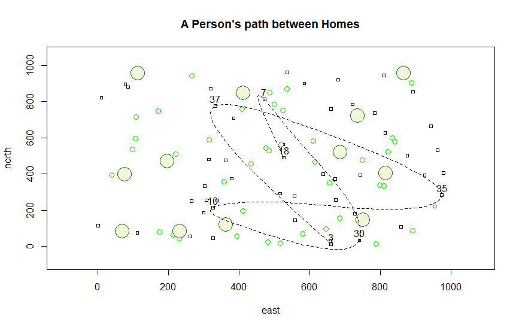

# Wicked Problems

Hello World! 

I am a freshman living on campus in Camm Hall. I have lived in NOVA for the previous seven years. Prior to that I lived in North Yorkshire, England. I lived there for 5 years after moving from Hawaii when I was 6. 

I enjoy playing a variety of sports. Mainly I play soccer and volleyball but I also snowboard and surf when I get the opportunity. Recently, I have just been working out and running since it’s much harder to play organized sports. I also enjoy playing video games.

## Projects

### Getting Started With R: Challenge Problem

[Project 1](Project1.md)

[Project 2](Project2.md)

## Informal Responses

[Informal Response 1](InformalResponse1.md)

